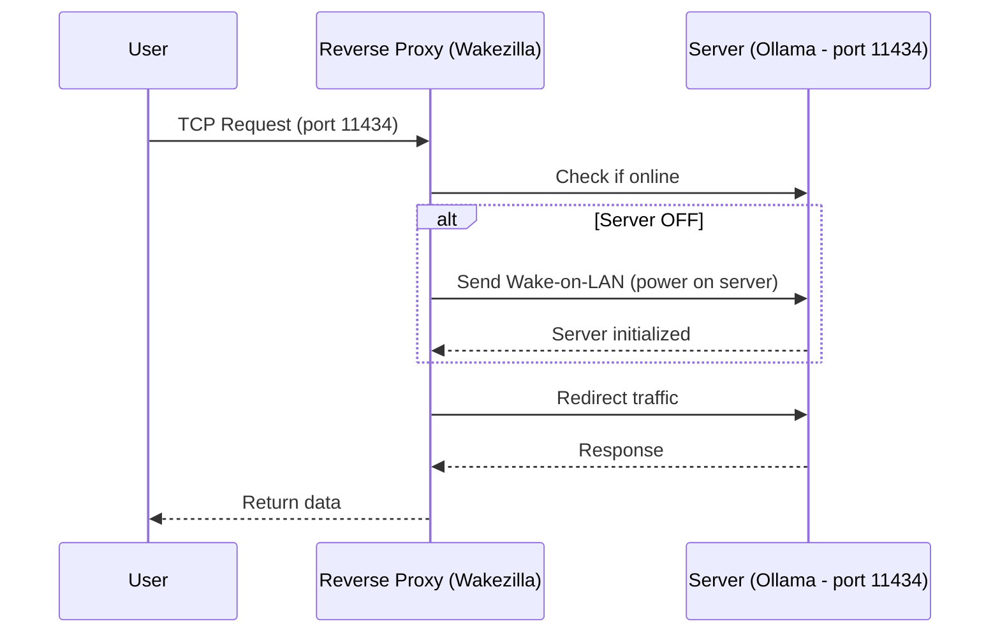

---
date: 2025-07-09
author: guibeira
tags: rust,self-host

card_image: https://private-user-images.githubusercontent.com/10093193/486531251-e88f084b-47b8-467b-a5c6-d64327805792.png?jwt=eyJ0eXAiOiJKV1QiLCJhbGciOiJIUzI1NiJ9.eyJpc3MiOiJnaXRodWIuY29tIiwiYXVkIjoicmF3LmdpdGh1YnVzZXJjb250ZW50LmNvbSIsImtleSI6ImtleTUiLCJleHAiOjE3NTcyNjU4OTIsIm5iZiI6MTc1NzI2NTU5MiwicGF0aCI6Ii8xMDA5MzE5My80ODY1MzEyNTEtZTg4ZjA4NGItNDdiOC00NjdiLWE1YzYtZDY0MzI3ODA1NzkyLnBuZz9YLUFtei1BbGdvcml0aG09QVdTNC1ITUFDLVNIQTI1NiZYLUFtei1DcmVkZW50aWFsPUFLSUFWQ09EWUxTQTUzUFFLNFpBJTJGMjAyNTA5MDclMkZ1cy1lYXN0LTElMkZzMyUyRmF3czRfcmVxdWVzdCZYLUFtei1EYXRlPTIwMjUwOTA3VDE3MTk1MlomWC1BbXotRXhwaXJlcz0zMDAmWC1BbXotU2lnbmF0dXJlPWY2ZDVjNTE3ZGY1MzBkODY3ZTEyZTM1YTNhNDI1MzQzZDFlOGFlYWU4ODY4YWI4ZjgwYmI1N2FhYTBlOTYwMjEmWC1BbXotU2lnbmVkSGVhZGVycz1ob3N0In0.cvx_2cTNHJ-7ARa_F0x0mOD25C0SxIDp-d1N1zTh5lA
banner_image: media/posts/wakezilla/banner.png
extra:
  mermaid: true
  mermaid_theme: default
---


# Saving Energy in Self-Hosting, Wake-on-LAN, and Rust


### Introduction

Some time ago, I started exploring the world of self-hosting, and since it’s so addictive, you always find yourself thinking about which new services you could host. I have a pretty simple machine, an Intel i3 (4th gen) with an GTX 1650 4GB GPU not too power-hungry.

Since my GPU was underused, I decided to install [Ollama](https://ollama.com), a tool that allows running AI models locally. After testing Ollama, I quickly realized that 4GB wasn’t enough to run the latest models.

### Hardware Upgrade

With this new problem, I now had the perfect excuse to upgrade my other machine the one I use for gaming. After a lot of research, I managed to get a good deal on an RX 7900 XTX. Now I have 24GB to run the latest models. But I was surprised by its power consumption, easily pulling around 45 watts in idle. This raised a red flag: keeping this machine on 24/7 would be far from energy-efficient.

### Initial Idea

What if I had a way to power on the machine only when I needed it? I’d need another device to manage it. A Raspberry Pi would be perfect, since I could leave it running 24/7 (its power draw is minimal), and it could turn the power-hungry machine on and off.

### Wake-on-LAN

With that in mind, I started looking into ways to remotely turn my machine on. That’s when I discovered Wake-on-LAN, or simply WoL. After configuring my motherboard and operating system, I was able to power on my machine remotely with this simple command:

```bash
wakeonlan <MAC_ADDRESS>
```

Because of how WoL works, it sends a “magic packet” over the local network meaning you need to be on the same LAN to wake the machine. That’s fine, one less problem. Now I had the ability to turn the machine on remotely, which led to the next question: when do I need to power it on? The answer was simple whenever I needed to access services running on it, like Ollama or any other self-hosted service.


### Intercepting Traffic

Most services use a specific port, such as 11434 for Ollama (where it opens a TCP connection). I thought of using a reverse proxy to intercept the traffic and, when necessary, wake the server. Once the server was online, the proxy could redirect the traffic to it. Perfect now we’d have the ability to wake the server remotely only when needed.



### When to Shut Down the Server? 

Now that we can remotely power on the server, we also need to decide when to shut it down.
I don’t want it running 24/7, so I thought: since we’re already intercepting traffic, why not monitor it? When no more requests come in, the server can be shut down. By adding a requests-per-minute threshold, if no requests are made, the server can be turned off.

### How to Do This?

After some research, I didn’t find many tools that did exactly what I wanted, so I decided to build my own solution. Since the target machine would need some software anyway to receive the shutdown command, I kept it simple: a CLI that starts a small web server. When it receives an unauthenticated HTTP request (for now), it shuts down the machine. I also added a health check so the reverse proxy can verify whether the machine is online.


### Wakezilla

With that in mind, I built Wakezilla a simple tool that does exactly this: it intercepts traffic, wakes the server with WoL when needed, and powers it down when there’s no more traffic.
All of this in a straightforward way, written in Rust, packaged as a single binary with no external dependencies making it easy to use anywhere.


### Open Source Project
The project is available on GitHub, and contributions are welcome whether to add new features or improve documentation.
If you’d like to try it out, just follow the instructions in the project’s README. If you have any questions, feel free to open an issue and I’ll be happy to help.
Here’s the project link:: [Wakezilla](https://github.com/guibeira/wakezilla)


