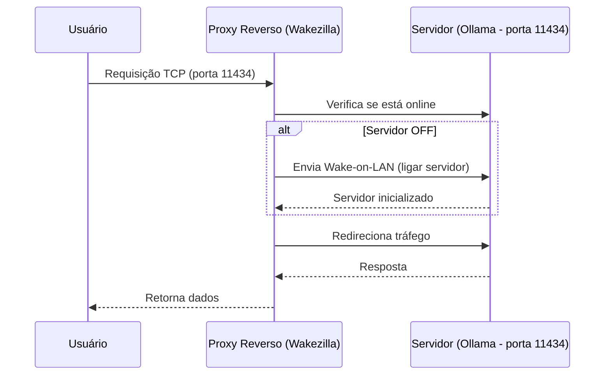

---
date: 2025-07-09
author: guibeira
tags: rust,self-host
card_image: media/posts/wakezilla/wakezilla.png
banner_image: media/posts/wakezilla/wakezilla.png
extra:
  mermaid: true
  mermaid_theme: default
---


# Economizando energia no self-hosting, Wake-on-LAN e Rust


### Introdução

Há algum tempo, comecei a explorar o mundo do self-hosting, e como isso é viciante, você sempre se pega pensando em quais novos serviços poderia hospedar. Tenho uma máquina bem simples, um Intel I3 de quarta geração, com uma placa de vídeo RTX 1650 de 4gb, ou seja, não consome muita energia. 
Sabendo que minha placa era subutilizada, decidi instalar o [Ollama](https://ollama.com), uma ferramenta que permite rodar modelos de IA localmente, e após conseguir testar o Ollama, logo percebi que 4gb não era suficiente para rodar os modelos mais recentes. 

### Upgrade de hardware

Com esse novo problema, agora tinha a desculpa perfeita para fazer o upgrade da minha outra máquina, a que eu uso para jogos. Após muita pesquisa, acabou que consegui um bom negócio em uma RX7900xtx, e com isso, agora tenho 24gb para rodar os modelos mais recentes. Mas me surpreendi com seu consumo, facilmente consumindo mais de 300 watts. O que levantou um alerta, deixar essa máquina ligada 24/7 não seria nada eficiente em termos de consumo de energia.  

### Ideia inicial

E se eu tivesse uma forma de ligar a máquina apenas quando eu precisasse? Precisaria de outro dispositivo para gerenciar, poderia usar um Rapberry pi para fazer isso, assim poderia deixar o pi ligado 24/7 , visto que não consumiria muita energia, e ele ligaria e desligaria a máquina que consome mais energia. 

### Wake-on-LAN

Pensando nisso, comecei a pesquisar formas de ligar minha máquina remotamente, e foi aí que descobri o Wake-on-LAN, ou simplesmente WoL. Após configurar minha placa mãe e o sistema operacional, consegui ligar minha máquina remotamente usando este simples comando:

```bash
wakeonlan <MAC_ADDRESS>
```

Devido ao modo como o WoL funciona, ele envia um pacote mágico na rede local, ou seja, você precisa estar na mesma rede para conseguir ligar a máquina, mas tudo bem, um problema a menos. Agora temos a habilidade de ligar a máquina remotamente, isso me levou a outra pergunta. Quando eu preciso ligar o servidor? A resposta é simples, quando eu precisar acessar os serviços que estão rodando nele, como o Ollama, ou qualquer outro serviço que eu queira hospedar.


### Interceptando o tráfego

A maioria dos serviços usa alguma porta específica, como o 11434 para o Ollama, onde ele abre uma conexão TCP, pensei em usar um proxy reverso para interceptar o tráfego, e quando necessário, ligar o servidor, e assim que o servidor estiver online, redirecionar o tráfego para ele, perfeito, agora teremos a habilidade de ligar o servidor remotamente quando necessário. 



### Quando desligar o servidor? 

Agora que temos a habilidade de ligar o servidor remotamente, precisamos pensar em quando desligar o servidor.
Não quero deixar o servidor ligado 24/7, então pensei, já que estamos interceptando o tráfego, podemos monitorar, e quando não houver mais nenhum requeste, desligar o servidor. Assim, adicionamos a configuração de requestes por minuto, e quando não houver mais requisições, podemos desligar o servidor.


### Como fazer isso?

Após pesquisar um pouco, não encontrei muitas opções que fizessem exatamente o que eu queria, então decidi criar minha própria solução. Visto que, de qualquer maneira, precisaria configurar a máquina destino com algum tipo de software para receber o comando de desligar, decidi que fazer o mais simples possível, uma cli que abre um servidor web, e quando recebe uma requisição HTTP, sem autenticação (por enquanto), desliga a máquina, aproveitei e adicionei um  health check, para que o proxy reverso consiga verificar se a maquina está online ou não.


### Wakezilla

Com isso em mente, desenvolvi o Wakezilla, uma ferramenta simples que faz exatamente isso: intercepta o tráfego, e quando necessário, liga o servidor usando WoL, e quando não houver mais tráfego, desliga o servidor. 
Tudo isso de forma simples, usando Rust, e com um binário único, sem dependências externas, tornando fácil de usar em qualquer lugar.


### Projeto open source
O projeto está disponível no GitHub, e qualquer contribuição é bem-vinda, seja para adicionar novas funcionalidades ou para melhorar a documentação.
Se quiser testar, basta seguir as instruções no README do projeto, e caso tenha alguma dúvida, pode abrir uma issue que eu terei o maior prazer em ajudar.
O link do projeto é esse: [Wakezilla](https://github.com/guibeira/wakezilla)

